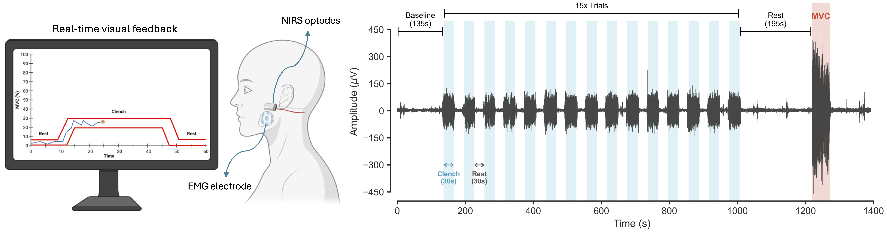
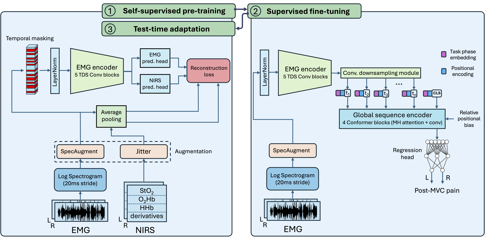

# LENS

Official implementation of **"LENS: a transferable neuromuscular signature of musculoskeletal pain intensity"**.

LENS (Latent sEMG Neuromuscular Signature) is a deep learning framework for deriving a transferable latent sEMG neuromuscular signature of musculoskeletal pain intensity. The model is trained with a cross-modal self-supervised objective, fine-tuned for pain prediction, and calibrated to individual physiology through test-time adaptation.



## Repository Overview

This repository contains the complete training, adaptation, and evaluation pipeline for LENS, as well as the benchmark comparative baseline models:

1. **Self-Supervised Pretraining (SSP)**: Cross-modal representation learning from multimodal peripheral physiology.
2. **Supervised Fine-Tuning (SFT)**: Pain prediction using the learned latent representation.
3. **Test-Time Adaptation (TTA)**: Subject-specific calibration during final evaluation.
4. **Baseline Models**: Classical machine learning and statistical models evaluated across all experimental cohorts.



---

## Data Availability

The preprocessed data, participant demographics/cohort splits are available via the Borealis data repository:

> **Data Repository**: [Borealis (DOI: 10.5683/SP4/JCWT3H)](https://borealisdata.ca/dataset.xhtml?persistentId=doi:10.5683/SP4/JCWT3H)

Precomputed baseline feature sets are available in the `data/baseline_features` folder.

### Directory Placement

After downloading the data, organize the `data/` directory as follows:

```text
data/
├── processed/              # Preprocessed multimodal tensor files
├── ratings/                # Participant demographic & cohort split files (.csv)
│   ├── Participants_control_train.csv
│   ├── Participants_control_test.csv
│   └── Participants_TMD.csv
├── baseline_features/      # Precomputed feature dictionaries (.pkl)
│   ├── train_features.pkl
│   ├── test_features.pkl
│   └── tmd_features.pkl
└── figures/                # Overview and architecture figures
```

> **Note**: The preprocessing script (`src/preprocessing.py`) is provided for reference. The training and evaluation pipelines can be run directly using the preprocessed data and feature files from Borealis.

---

## Setup

The codebase is designed for Python 3.11.

```bash
# Create and activate virtual environment
python3.11 -m venv .venv
source .venv/bin/activate

# Install dependencies
python -m pip install --upgrade pip
pip install -r requirements.txt
```

If using a CUDA-enabled GPU system, install the corresponding PyTorch build following the official [PyTorch installation guide](https://pytorch.org/get-started/locally/).

---

## LENS Training & Evaluation

### End-to-End Pipeline

To execute the canonical three-stage pipeline (SSP $\rightarrow$ SFT $\rightarrow$ TTA):

```bash
bash scripts/run_training.sh
```

### Stage-Wise Execution

Each stage can also be launched independently:

#### 1. Self-Supervised Pretraining (SSP)
```bash
python src/train.py \
  --run_ssp \
  --log_dir runs/experiment_name/ssp \
  --ssp_weights_path runs/experiment_name/ssp_model.pt \
  --ssp_on_all_data
```

#### 2. Supervised Fine-Tuning (SFT)
```bash
python src/train.py \
  --run_supervised \
  --log_dir runs/experiment_name/sft \
  --ssp_weights_path runs/experiment_name/ssp_model.pt \
  --sup_weights_path runs/experiment_name/supervised_model.pt \
  --participants_train data/ratings/Participants_control_train.csv \
  --participants_test data/ratings/Participants_control_test.csv \
  --use_separate_test_set
```

#### 3. Test-Time Adaptation (TTA) & Final Evaluation
```bash
python src/train.py \
  --run_final_evaluation \
  --log_dir runs/experiment_name/tta \
  --sup_weights_path runs/experiment_name/supervised_model.pt \
  --participants_train data/ratings/Participants_control_train.csv \
  --participants_test data/ratings/Participants_control_test.csv \
  --use_separate_test_set \
  --adaptation
```

### Outputs

Artifacts are written to the selected `--log_dir`, including model checkpoints, TensorBoard logs, and saved prediction files from final evaluation.

---

## Baseline Models

The repository provides implementations for the benchmark comparative models evaluated in the study:

- **PLS-PreRegistered**: Partial Least Squares regression with nested cross-validation.
- **SpectralShift-Linear**: Ridge linear regression on median frequency shift features.
- **Linear-EMG**: Linear Ridge regression on classical sEMG and NIRS features.
- **XGBoost-EMG**: Gradient boosted decision trees on classical sEMG and NIRS features.

### Running Baselines

To run the baseline evaluation suite across within-cohort cross-validation, out-of-sample generalization, and cross-cohort clinical transfer:

```bash
python scripts/run_baselines.py
```

This uses the precomputed feature sets in `data/baseline_features/` and outputs the evaluation summary to `data/baseline_results.csv`.

---

## Citation

If you use this repository or find our work useful, please cite the associated LENS paper.
